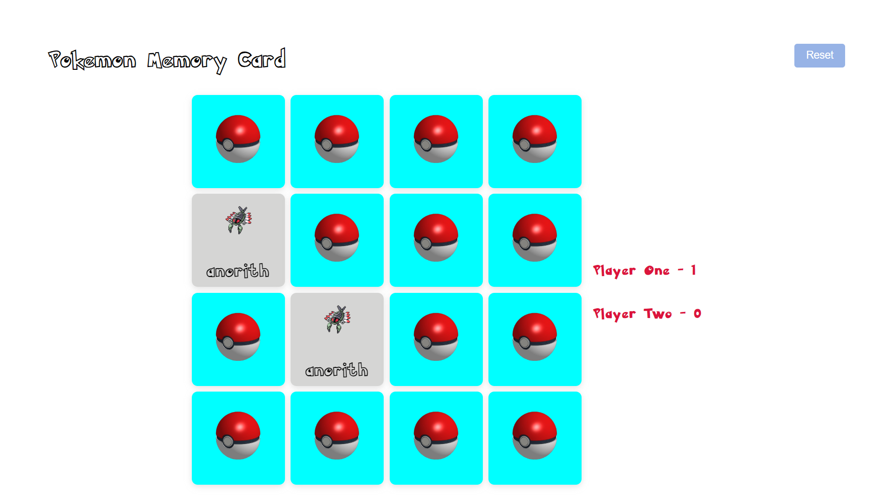

# Pokemon Memory Card
### Memory card game using vanilla JS with async/await and API calling

In this project, vanilla JS, CSS, and HTML are used to represent a memory game by connecting to the [PokéAPI](https://pokeapi.co/).

It keeps track of the matched pairs found by the players and determines if Player 1, Player 2, or a tie has won.

*Screen capture*
